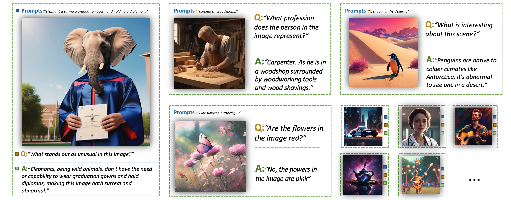

# Official repo for StableLLaVA
**StableLLaVA: Enhanced Visual Instruction Tuning with Synthesized Image-Dialogue Data**

Yanda Li, [Chi Zhang](https://icoz69.github.io/), Gang Yu, Zhibin Wang, Bin Fu, Guosheng Lin, Chunhua Shen, Ling Chen, Yunchao Wei

[[Arxiv]](https://arxiv.org/abs/2308.10253v1)

**This repository offers a collection of AI-generated datasets specifically tailored for visual instruction tuning.**

## Abstract

 The remarkable multimodal capabilities demonstrated by OpenAI's GPT-4 have sparked significant interest in the development of multimodal Large Language Models (LLMs). A primary research objective of such models is to  align visual and textual modalities effectively while comprehending human instructions.
 Current methodologies often rely on annotations derived from benchmark datasets to construct image-dialogue datasets for training purposes, akin to instruction tuning in LLMs. However,  these datasets often exhibit domain bias, potentially   constraining the generative capabilities of the models. In an effort to mitigate these limitations, we propose a novel data collection methodology that synchronously synthesizes images and dialogues for visual instruction tuning. This approach harnesses the power of generative models, marrying the abilities of ChatGPT and text-to-image generative models to yield a diverse and controllable dataset with varied image content. This not only provides greater flexibility compared to existing methodologies but also significantly enhances several model capabilities. Our research includes comprehensive experiments conducted on various  datasets using the open-source LLAVA model as a testbed for our proposed pipeline. Our results underscore marked enhancements across more than ten commonly assessed capabilities.



## Pipeline 
The prompt-dialogue of varies abilities are saved in [dataset](https://github.com/crystraldo/StableLLAVA/tree/main/dataset).

Firstly, use [SD-XL](https://github.com/crystraldo/StableLLAVA/blob/main/stable_diffusion.py) to generate images as training images. It will take ~13s for generating one image on V100.
```
python stable_diffusion.py --prompt_path dataset/animal.json --save_path train_set/animal/
```

Second, use [data_to_llava](https://github.com/crystraldo/StableLLAVA/blob/main/data_to_llava.py) to convert dataset format for LLaVA model training.
```
python data_to_llava.py --image_path train_set/animal/ --prompt_path dataset/animal.json --save_path train_ano/animal.json
```

For training model, you can use LLaVA official code [LLaVA](https://github.com/haotian-liu/LLaVA)


 ## TO DO LIST
- [ ] Update datasets and instruction templates
- [ ] Keep incorporating more capabilities
- [ ] Demo and Codes
